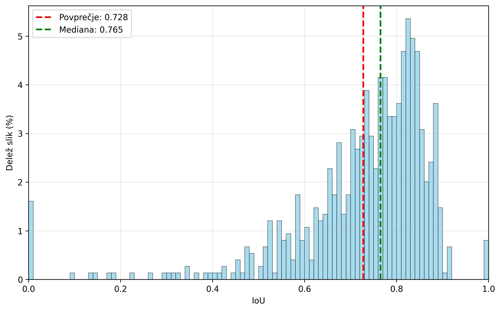
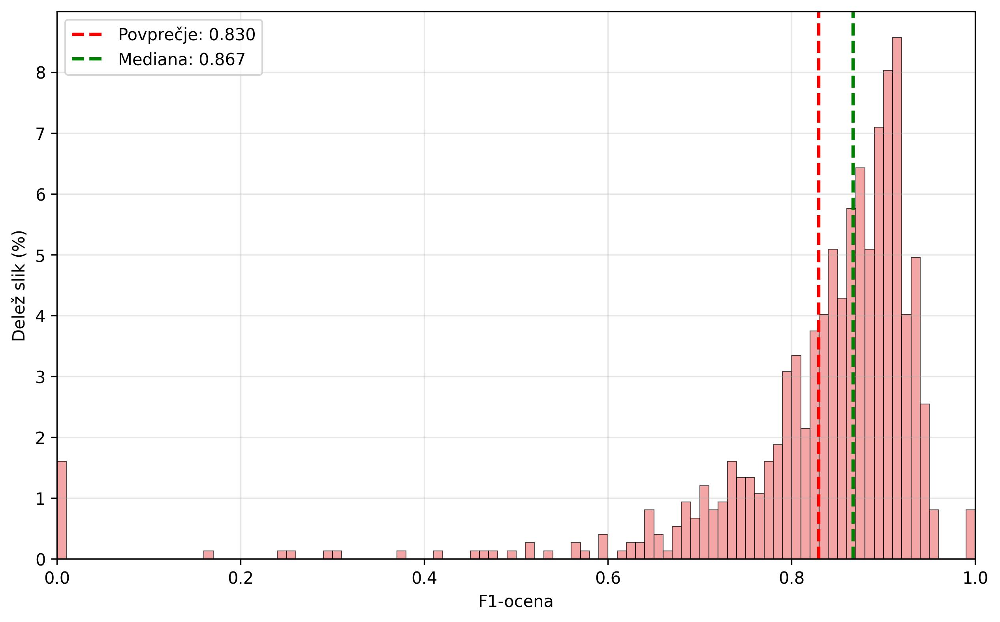
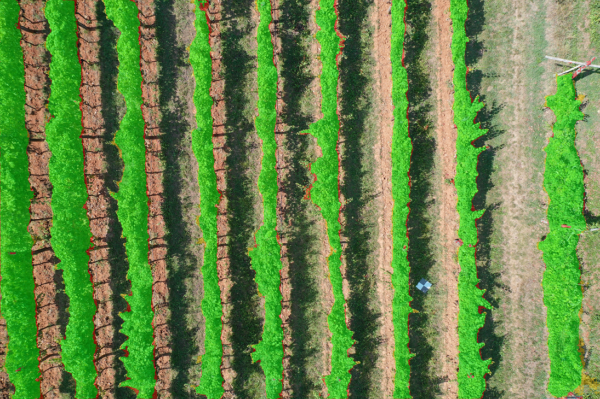
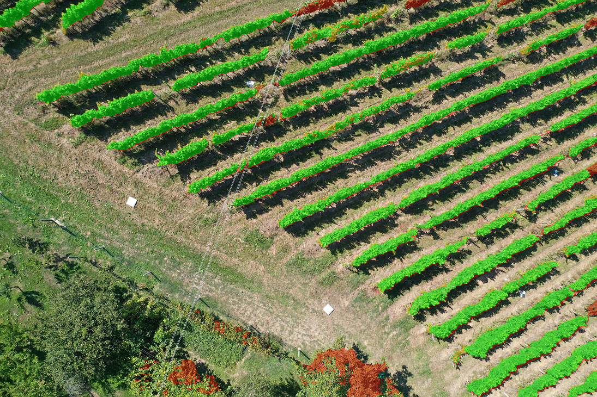
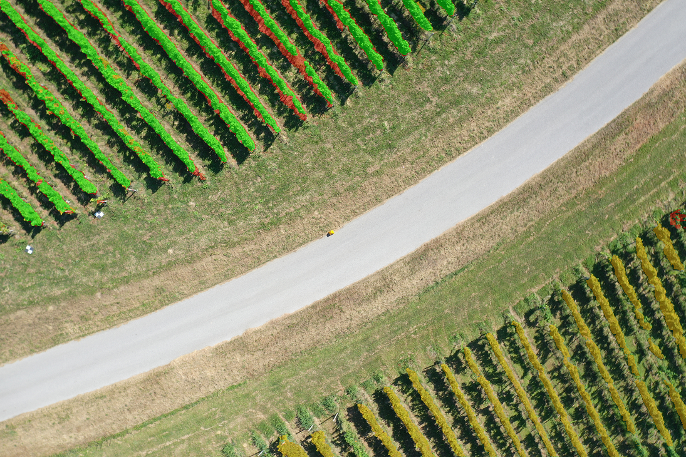
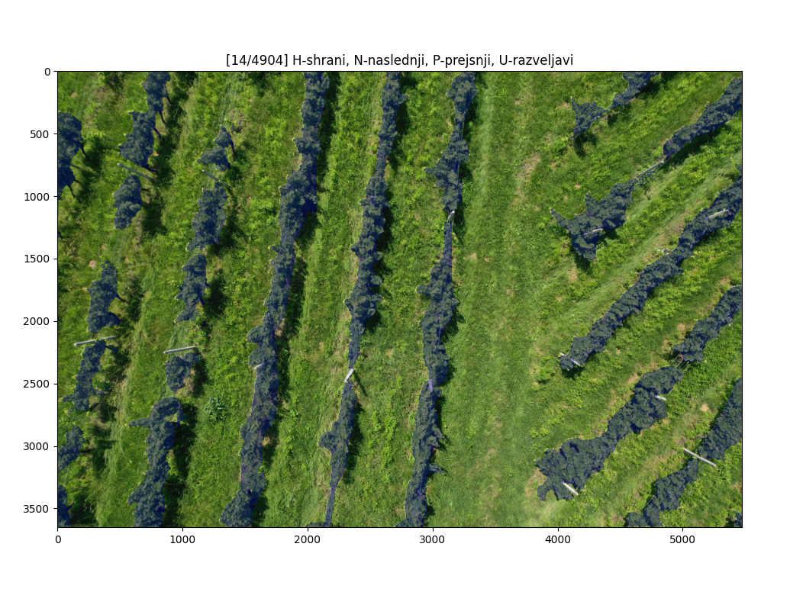

# Vineyard Segmentation with Fine-tuned SAM 2

Fine-tuning of Meta's **Segment Anything Model 2.1 (Large)** to segment grapevines in high-resolution
drone images, including a custom semi-automatic annotation tool and a full evaluation pipeline.

Bachelor's thesis project, University of Ljubljana, Faculty of Electrical Engineering (2025).
Mentor: prof. dr. Vitomir Štruc, co-mentor: asist. dr. Jon Natanael Muhovič.
Thesis: *Segmentacija vinskih trt iz slikovnih podatkov s temeljnimi modeli* (Slovenian; English title:
*Vineyard segmentation from image data with foundation models*).

## Results

Test set: 747 held-out drone images (5472×3648 px). Both models use the same inference pipeline
and parameters.

| Model | Mean IoU | Median IoU | Mean F1 | Median F1 |
|---|---|---|---|---|
| SAM 2.1 Large, zero-shot | 0.190 | 0.165 | 0.302 | 0.283 |
| **SAM 2.1 Large, fine-tuned (this repo)** | **0.728** ± 0.157 | **0.765** | **0.830** ± 0.144 | **0.867** |

- Fine-tuned model: 1.6 % of test images were missed completely (IoU = 0).
- Inference on the full test set took 11 h 22 min on one H100 (≈ 55 s per image).
- Best validation IoU: 0.7498 (iteration 27,000). Reported test results use the final checkpoint (iteration 30,000).



*IoU distribution on the test set.*



*F1 distribution on the test set.*

#Examples (green = true positive, red = false positive, orange = false negative):

| Good (IoU 0.916) | Average (IoU 0.764) | Partial failure (IoU 0.476) |
|---|---|---|
|  |  |  |

In the partial-failure case the image was taken from a higher altitude and the lower vineyard block
was not detected.

## Method

Data consists of 3,735 RGB drone images with binary vine masks, split randomly into 2,944 train / 44 validation /
747 test images. Masks were created with the annotation tool (`annotate.py`):
the user clicks on vines, SAM 2 proposes a mask for a local crop around the click, and the user keeps or
undoes it. Masks larger than half of the crop are rejected automatically.



*Annotation example.*

**Training:**
- Base model: SAM 2.1 Hiera-Large. The image encoder is not updated (image features are computed under
  `torch.no_grad()` inside `SAM2ImagePredictor.set_image_batch`); the prompt encoder and mask decoder are trained.
- Each iteration: 10 random images, a random 1024×1024 crop of each, horizontal flip and slight Gaussian blur
  as occasional augmentation, and 16–156 random point prompts (positive and negative, random or jittered grid).
- Loss: binary cross-entropy on mask logits + 0.1 × L1 loss between predicted and actual IoU score.
- AdamW (lr 3e-4, weight decay 4e-5), gradient clipping at 1.0, mixed precision (FP16),
  `ReduceLROnPlateau` on validation IoU (factor 0.7, patience 1, min lr 1e-6).
- 30,000 iterations, validation every 1,500 iterations. Trained on one NVIDIA H100 (80 GB) on the
  SLING HPC cluster.

**Inference (`evaluate.py`).** Each image is split into 2×2 tiles; `SAM2AutomaticMaskGenerator`
(46 × 46 point grid, IoU / stability / box-NMS thresholds 0.3, minimum region area 10 px) runs on every
tile and all masks are merged into one binary vineyard mask. Metrics: IoU and F1 per image
(an empty ground truth with an empty prediction counts as 1.0).

## Repository structure

```
train.py        fine-tuning
evaluate.py     inference and metrics, saves masks, overlays and results.csv
annotate.py     annotation tool
docs/img/       figures used
```

## Setup

Requires a CUDA GPU, Python ≥ 3.10 and PyTorch ≥ 2.5.1 (as required by SAM 2).

```bash
pip install -r requirements.txt
git clone https://github.com/facebookresearch/sam2.git && cd sam2 && pip install -e . && cd ..
# download sam2.1_hiera_large.pt (see checkpoints/download_ckpts.sh in the SAM 2 repository)
```

Data layout (the dataset is **not** included in this repository):

```
data/images/<any subfolders>/IMG_0001.JPG
data/masks/<same subfolders>/IMG_0001.png
checkpoints/sam2.1_hiera_large.pt
```

Paths can be changed with the environment variables `IMAGE_ROOT`, `MASK_ROOT`, `SAM2_CHECKPOINT`.

## Usage

```bash
python train.py                                   # fine-tune; checkpoints go to results_<run_id>/
MODEL_PATH=results_<run_id>/SSD_h100_final_iter030000.torch python evaluate.py
ZERO_SHOT=1 RESULTS_DIR=results_zero_shot python evaluate.py   # baseline with original weights
python annotate.py                                # annotation tool (keys: h save, n next, p previous, u undo)
```

`evaluate.py` evaluates the whole test split by default (set `USE_FULL_TEST = False` for a quick check on 5 images).

## Limitations

- Dataset not provided, model strength depends on dataset quality.
- Inference is slow (≈ 55 s per image) because of the dense point grid.
- Performance drops on images taken from greater heights and on small, sparse vineyards.

## License and acknowledgements

Code in this repository: MIT License. Built on [SAM 2](https://github.com/facebookresearch/sam2)
(Ravi et al., 2025), which is released by Meta under the Apache 2.0 license.
